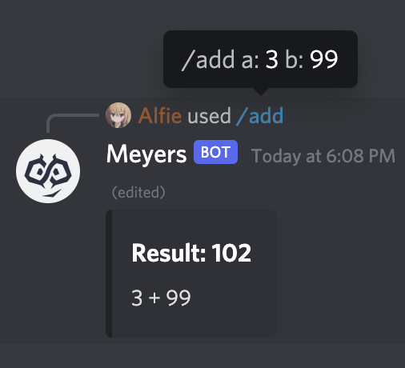

# Reaccord

> Disclaimer: Reaccord is using the development version of `discord.js` (v14), so the API is still unstable and may not be suitable for production.

```tsx
import { createClient } from 'reaccord';

// Create client
const { connect, createCommand } = createClient({
    token: 'token',
    intents: ["Guilds", "GuildMessages", "GuildMessageReactions"],
    devGuildId: 'dev-guild-id',
    clientId: 'client-id',
})

// Register simple `ping` command
createCommand("ping", "Ping").render(() => (
    <content>Pong</content>
))

// Register command with string param
createCommand("echo", "Echoes msg")
    .stringParam("input", "Message to be echoed", { required: true })
    .render(({ input }) => <content>{input}</content>)

// Register command with multiple params
createCommand("add", "Add two numbers")
    .numberParam("a", "First number", { required: true })
    .numberParam("b", "Second number", { required: true })
    .render(({ a, b }) => (
        <embed>
            <title>Result: {a + b}</title>
            <desc>
                {a} + {b}
            </desc>
        </embed>
    ))

// Connect client
connect((client) =>
    console.log(`🚀 Client connected as ${client.user?.username}!`),
);
```

**Ping command result**


**Echo command result**


**Add command result**
